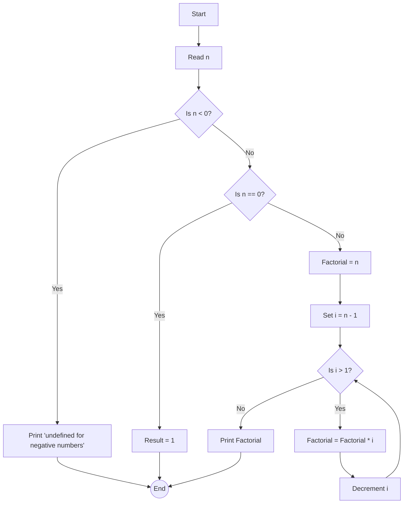

# Factorial

## Description

For this example, we're going to use factorial. The factorial of a non-negative integer \( n \) is the product of all
positive
integers less than or equal to \( n \).

### Equation

It is denoted by \( n! \) and is generally defined as:

``` tex
\begin{equation}
n! = 
\begin{cases} 
1 & \text{if } n = 0, \\
n \cdot (n - 1)! & \text{if } n > 0.
\end{cases}
\end{equation}
```

The function can be implemented recursively, where \( n! \) is the product of \( n \) and the factorial of \( n - 1 \),
with the base case being \( 0! = 1 \).

### Flowchart



## Code Example

<tabs>
  <tab title="Rust">
    <code-block lang="c"><![CDATA[
      /// Calculates the factorial of a number.
      ///
      /// Given a non-negative integer `n`, this function returns the factorial of `n`, 
      /// which is the product of all positive integers less than or equal to `n`.
      ///
      /// # Examples
      ///
      /// ```
      /// let five_factorial = factorial(5);
      /// assert_eq!(five_factorial, 120);
      /// ```
      ///
      /// # Arguments
      ///
      /// * `n` - A u64 non-negative integer
      ///
      /// # Returns
      ///
      /// * A u64 representing the factorial of `n`
      fn factorial(n: u64) -> u64 {
          if n <= 1 {
              1
          } else {
              n * factorial(n - 1)
          }
      }
      fn main() {
          let num = 5;
          println!("The factorial of {} is {}", num, factorial(num));
      }
    ]]></code-block>
  </tab>
  <tab title="C++">
    <code-block lang="c++"><![CDATA[
      #include <iostream>;
      /**
      * Calculates the factorial of a number.
      *
      * @param n A non-negative integer to calculate the factorial of.
      * @return The factorial of `n`.
      *
      * Example:
      *   auto result = factorial(5); // result is 120
      */
      unsigned long long factorial(unsigned long long n) {
          if (n == 0 || n == 1) return 1;
          else return n * factorial(n - 1);
          }
      int main() {
          unsigned long long num = 5;
          std::cout << "The factorial of " << num << " is " << factorial(num) << std::endl;
          return 0;
      }
    ]]></code-block>
  </tab>
  <tab title="Python">
    <code-block lang="python"><![CDATA[
      def factorial(n):
          """Calculate the factorial of a number.
          Args:
              n (int): A non-negative integer to calculate the factorial of.
          Returns:
              int: The factorial of `n`.
          Examples:
              >>> factorial(5)
              120
          """
          if n == 0 or n == 1:
              return 1
          else:
              return n * factorial(n - 1)
      num = 5
      print(f"The factorial of {num} is {factorial(num)}")
    ]]></code-block>
  </tab>
</tabs>
