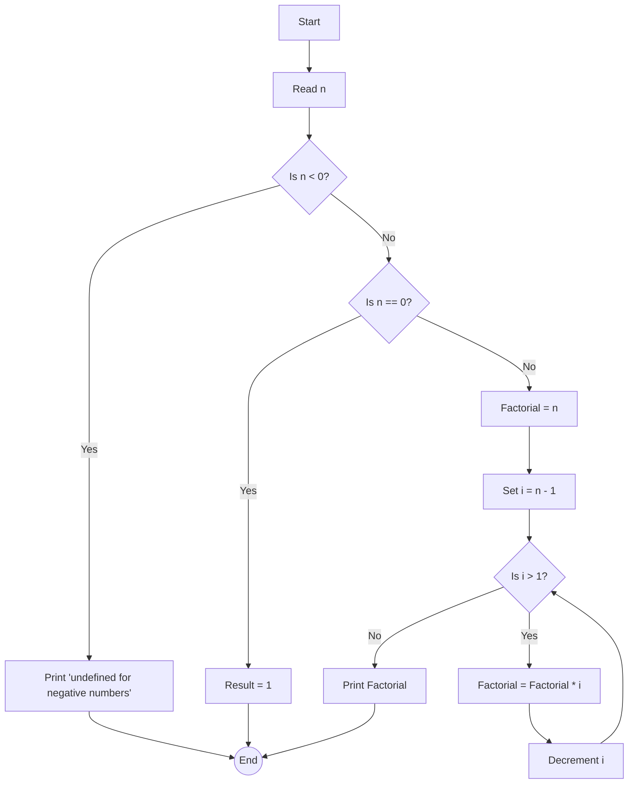

# Factorial

## Description

For this example, we're going to use factorial. The factorial of a non-negative integer \( n \) is the product of all
positive
integers less than or equal to \( n \).

### Equation

It is denoted by \( n! \) and is generally defined as:

``` tex
\begin{equation}
n! = 
\begin{cases} 
1 & \text{if } n = 0, \\
n \cdot (n - 1)! & \text{if } n > 0.
\end{cases}
\end{equation}
```

The function can be implemented recursively, where \( n! \) is the product of \( n \) and the factorial of \( n - 1 \),
with the base case being \( 0! = 1 \).

### Flowchart



## Code Example

<tabs>
  <tab title="Rust">
    <code-block lang="c" src="factorials.rs" validate="false" />
  </tab>
  <tab title="C++">
    <code-block lang="c++" src="factorials.cpp" validate="false" />
  </tab>
  <tab title="Python">
    <code-block lang="python" src="factorials.py" validate="false" />
  </tab>
</tabs>
