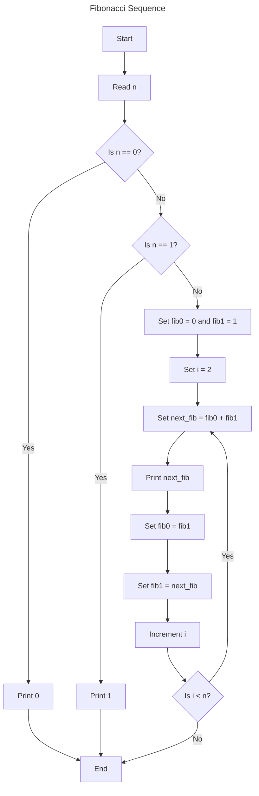

# Fibonacci Sequence

## Description

The Fibonacci sequence is a series of numbers where each number is the sum of the two preceding ones, usually starting
with 0 and 1. That is, the sequence starts 0, 1, 1, 2, 3, 5, 8, 13, ...

### Algorithm

The n-th number of the Fibonacci sequence F(n) is computed as:

```tex
\begin{equation}
F(n) = 
\begin{cases} 
0 & \text{if } n = 0, \\
1 & \text{if } n = 1, \\
F(n-1) + F(n-2) & \text{if } n > 1.
\end{cases}
\end{equation}
```

This function can be implemented iteratively or recursively. The iterative approach is usually more efficient as it does
not involve the overhead of recursive function calls.

### Flowchart



## Code Example

<tabs>
  <tab title="Rust">
    <code-block lang="c" src="rust/fibonacci_sequence.rs" validate="false" />
  </tab>
  <tab title="C++">
    <code-block lang="c++" src="cpp/fibonacci_sequence.cpp" validate="false" />
  </tab>
  <tab title="Python">
    <code-block lang="python" src="python/fibonacci_sequence.py" validate="false" />
  </tab>
</tabs>
