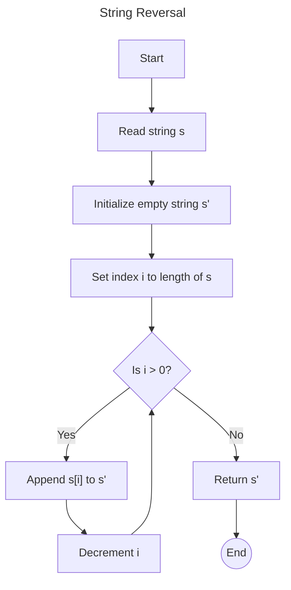

# String Reversal Function

## Description

The purpose of the function is to take a string as input and return its reverse. A string is a sequence of characters,
and reversing it means that the characters are read backward, from the last character to the first one.

### Algorithm

The string reversal function, denoted as `rev`, takes a string `s` of length `n` and returns a new string `s′`
such that:

```tex
\begin{equation}
\text{rev}(s) = s' = s_n s_{n-1} ... s_2 s_1
\end{equation}
```

### Flowchart



## Code Example

<tabs>
    <tab title="Rust">
        <tabs>
            <tab title="With Standard Libraries">
                <code-block lang="c" src="string_reversal.rs" validate="false" include-lines="1-29"/>
            </tab>
            <tab title="Without Standard Libraries">
                <code-block lang="c" src="string_reversal.rs" validate="false" include-lines="1-13,32-45"/>
            </tab>
      </tabs>
    </tab>
    <tab title="C++">
        <tabs>
            <tab title="With Standard Libraries">
                Header file
                <code-block lang="c++" src="string_reversal.h" validate="false"/>
                Cpp file
                <code-block lang="c++" src="string_reversal.cpp" validate="false" include-lines="1-23"/>
            </tab>
            <tab title="Without Standard Libraries">
                <code-block lang="c++" src="string_reversal.cpp" validate="false" include-lines="26-49"/>
            </tab>
      </tabs>
    </tab>
    <tab title="Python">
        <tabs>
            <tab title="With Standard Libraries">
                <code-block lang="python" src="string_reversal.py" validate="false" include-lines="1-24"/>
            </tab>
            <tab title="Without Standard Libraries">
                <code-block lang="python" src="string_reversal.py" validate="false" include-lines="28-45"/>
            </tab>
      </tabs>
    </tab>
</tabs>
